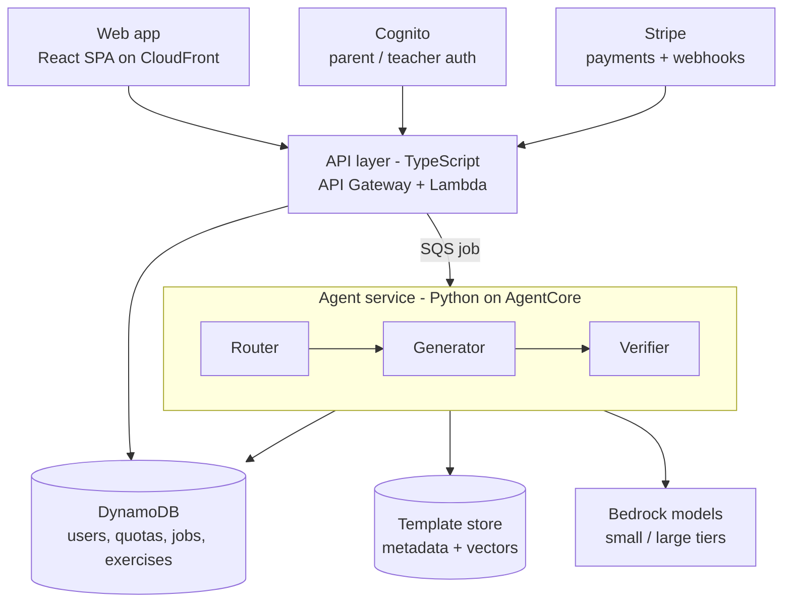

# MathSpark (working title)

AI-generated, verified math exercises for K–12 learners.

Parents and teachers sign up for free, create child profiles, and generate printable or interactive exercise sets by grade, topic, and curriculum standard. Paid plans raise the monthly quota and unlock advanced features such as adaptive difficulty and step-by-step hints.

This is also a portfolio project, so it is built as a real product: infrastructure as code, CI/CD, automated tests and evals, observability, and iterative delivery in sprints.

> **Status:** early development (Sprint 0 — walking skeleton). Sections marked _planned_ describe the target design and are not implemented yet.

---

## Guiding principles

1. **Never trust the LLM's arithmetic.** Every generated exercise is checked by deterministic code (SymPy) before a user sees it. An exercise that fails verification is regenerated or discarded, never shown.
2. **Cheapest correct route wins.** Many exercises need no LLM at all. The router picks template-only generation first, then a small model, and only uses a large model when the request needs it.
3. **Workflows before agents.** The generation pipeline is a deterministic workflow (route → generate → verify → review). Agents are used only where the path is genuinely open-ended.
4. **Children's privacy by design.** Only adults (parents, teachers) hold accounts. Child profiles contain a display name and grade level, no email, no other PII.
5. **Ship thin vertical slices.** Every sprint ends with something deployed and demoable.

---

## Architecture



### Request flow

1. The client calls `POST /exercise-sets` with grade, topic, standard code, count, and optional theme.
2. The API Lambda validates the request against the shared contract, then **atomically decrements quota** with a DynamoDB conditional update. If quota is exhausted it returns `402`.
3. The API writes a job record (`status: queued`) and enqueues it on SQS. It returns `202` with a `jobId`.
4. The agent service picks up the job and runs the pipeline:
   - **Router** — chooses `template`, `small-model`, or `large-model` based on grade, topic complexity, and whether a free-text theme was requested. Checks the pre-generated pool first.
   - **Generator** — retrieves matching templates (metadata filter first, vector similarity second) and produces exercises that conform to the exercise schema.
   - **Verifier** — recomputes every answer with SymPy, validates the schema, and runs a reviewer pass for age-appropriateness and wording (plus Bedrock Guardrails). Failures are retried up to N times, then dropped.
5. Results are written to DynamoDB and the job is marked `completed`. The client polls `GET /jobs/{jobId}` (WebSocket streaming is _planned_).

Failed jobs go to a dead-letter queue and refund quota.

---

## Tech stack

| Area | Choice | Why |
|---|---|---|
| Frontend | React + Vite, TypeScript, S3 + CloudFront | App sits behind login, so SSR adds friction without much benefit |
| API | TypeScript on AWS Lambda, API Gateway (HTTP API) | Same language as frontend; shared types |
| AI service | Python 3.12 on Amazon Bedrock AgentCore | SymPy for verification; Python-first agent and eval ecosystem |
| Orchestration | Deterministic workflow (LangGraph or Strands) | Testable, debuggable, cheaper than free-form multi-agent |
| Models | Amazon Bedrock, tiered small / large | Cost-aware routing |
| Data | DynamoDB (single-table design) | Serverless, pay-per-request, conditional writes for quotas |
| Retrieval | Metadata filtering + vectors (Bedrock Knowledge Bases) | Requests are mostly structured (grade, topic, standard) |
| Auth | Amazon Cognito | Adult accounts only; child profiles stored in DynamoDB |
| Payments | Stripe subscriptions + webhook Lambda | |
| Infrastructure | AWS CDK (TypeScript) | Infrastructure as code, same language as API |
| CI/CD | GitHub Actions with OIDC to AWS | No long-lived AWS keys |
| Monorepo | pnpm workspaces + Turborepo; `uv` for Python | Python service is a sibling, wired into Turbo via thin scripts |

---

## Repository structure

```
.
├── apps/
│   ├── web/                 # React SPA (Vite)
│   └── api/                 # Lambda handlers (TypeScript)
├── services/
│   └── agents/              # Python agent service (uv project)
│       ├── src/agents/
│       │   ├── router/
│       │   ├── generator/
│       │   ├── verifier/    # SymPy checks + reviewer
│       │   └── workflow.py  # pipeline definition
│       ├── evals/           # golden set + eval runners
│       ├── tests/
│       ├── pyproject.toml
│       └── package.json     # thin wrapper so Turbo can run Python tasks
├── packages/
│   ├── contracts/           # JSON Schema source of truth → Zod (TS) + Pydantic (Py)
│   ├── ui/                  # shared React components
│   └── config/              # shared eslint, tsconfig, prettier
├── infra/                   # CDK app: stacks per domain, stages per environment
├── docs/
│   ├── adr/                 # architecture decision records
│   └── runbooks/
├── .github/workflows/
├── turbo.json
├── pnpm-workspace.yaml
└── README.md
```

---

## Getting started

### Prerequisites

- Node.js 22 LTS and pnpm 9+
- Python 3.12 and [uv](https://docs.astral.sh/uv/)
- AWS CLI v2 with an SSO profile for the **dev** account
- AWS CDK CLI (`pnpm dlx aws-cdk` works without a global install)
- Docker (for building the AgentCore container image)

### Install

```bash
pnpm install                      # JS/TS workspaces
cd services/agents && uv sync     # Python dependencies
cd ../..
pnpm contracts:generate           # generate Zod + Pydantic types from JSON Schema
```

### Environment

Copy the example files and fill in values. Never commit real secrets; deployed environments read from AWS Secrets Manager / SSM Parameter Store.

```bash
cp apps/web/.env.example apps/web/.env.local
cp apps/api/.env.example apps/api/.env.local
cp services/agents/.env.example services/agents/.env
```

### Common commands

Run from the repo root unless noted.

| Command | What it does |
|---|---|
| `pnpm dev` | Runs the web app and local API |
| `pnpm build` | Builds all workspaces |
| `pnpm lint` | ESLint + Prettier (TS), Ruff (Python) |
| `pnpm typecheck` | `tsc --noEmit` (TS), mypy (Python) |
| `pnpm test` | Vitest (TS) and pytest (Python) via Turbo |
| `pnpm evals` | Runs the AI eval suite against the golden set |
| `pnpm contracts:generate` | Regenerates types after changing a schema |
| `pnpm cdk diff --context stage=dev` | Shows infrastructure changes |
| `pnpm cdk deploy --context stage=dev` | Deploys to the dev account |

Python-only, from `services/agents/`:

```bash
uv run pytest
uv run ruff check . && uv run ruff format .
uv run mypy src
uv run python -m evals.run --suite golden
```

---

## Data contracts

`packages/contracts` is the single source of truth for anything that crosses the TS/Python boundary (job payloads, the exercise schema, API request/response bodies).

- Edit the JSON Schema, then run `pnpm contracts:generate`.
- Never hand-edit generated files (`*.generated.ts`, `*_generated.py`).
- Breaking schema changes need a version bump and an ADR.

---

## Testing and evaluation

| Layer | Tooling | Runs in CI |
|---|---|---|
| Unit | Vitest, pytest | Every PR |
| Contract | Schema validation tests on both sides | Every PR |
| Infrastructure | CDK assertions + snapshot tests | Every PR |
| AI evals | Golden set: answer correctness (SymPy), schema validity, grade-level readability, cost and latency per exercise | Every PR touching `services/agents` |
| End-to-end | Playwright against the dev stage | On merge to `main` |

Eval results are reported per route tier so changes to routing can be judged on correctness **and** cost. A PR that lowers eval correctness below the threshold fails CI.

---

## Environments and deployment

| Stage | AWS account | Deploys when |
|---|---|---|
| `dev` | dev | Manually, or on merge to `main` |
| `prod` | prod | Tagged release after dev passes E2E |

GitHub Actions assumes a deploy role in each account through OIDC. There are no AWS access keys in the repository or in GitHub secrets.

---

## Ways of working

- **Sprints:** 2 weeks. Backlog and board live in GitHub Projects.
- **Branches:** short-lived `feat/…`, `fix/…`, `chore/…` branches off `main`. Squash merge.
- **Commits:** [Conventional Commits](https://www.conventionalcommits.org/) (`feat(api): add quota check`).
- **PRs:** small, linked to an issue, green CI required. Update docs and ADRs in the same PR.
- **Definition of done:** tests written, evals pass (if AI code changed), deployed to dev, docs updated.
- **Decisions:** significant architectural choices get an ADR in `docs/adr/` (template: `docs/adr/0000-template.md`).

---

## Working on this repo with Claude Code

This section is written for AI coding assistants as well as humans.

**Before making changes**
- Read the relevant workspace's code and any ADRs in `docs/adr/` that touch the area.
- For cross-boundary changes, start in `packages/contracts`, regenerate types, then update both sides.

**Rules**
- Use `pnpm` for JS/TS and `uv` for Python. Do not use `npm`, `yarn`, `pip`, or `poetry`.
- TypeScript is strict. Do not use `any`; validate external input with the generated Zod schemas.
- Python code is fully type-hinted and passes `mypy` and `ruff`.
- Any code path that produces an exercise answer must go through the verifier. Do not add shortcuts that skip verification, including in tests of the happy path.
- Do not store child PII. Child profiles hold only an ID, display name, grade, and settings.
- Infrastructure changes go in `infra/` via CDK. Do not create or modify AWS resources by hand or through the console.
- Do not commit secrets or `.env` files. Do not run `cdk deploy` against `prod`.
- Prefer small, focused changes. If a task needs a new dependency, explain why in the PR description.

**Before finishing a task, run**

```bash
pnpm lint && pnpm typecheck && pnpm test
pnpm evals        # only if services/agents changed
```

---

## Roadmap

- [ ] **Sprint 0–1 — Walking skeleton:** monorepo, CDK, CI/CD with OIDC, Cognito sign-in, one endpoint returning a hardcoded exercise, deployed to dev
- [ ] **MVP:** grades 1–3 arithmetic, template generator + one LLM path, SymPy verifier, eval harness, printable worksheet, free-tier quota
- [ ] **Monetization:** Stripe subscriptions, paid tier, usage dashboard
- [ ] **AI depth:** tiered model router, template retrieval, reviewer agent, cost-per-exercise metrics
- [ ] **Advanced:** adaptive difficulty, step-by-step hints, WebSocket progress, more grades and curricula (Common Core, NZ Curriculum)

---

## License

TBD.
